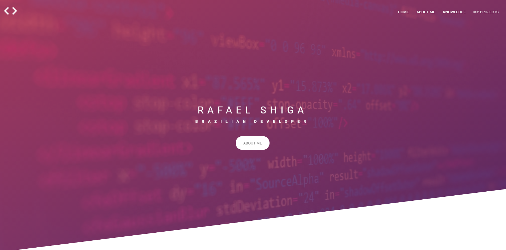

<h1 align="center">
  
   
  Shiga Projects
</h1>

<h3 align="center">
<strong>Showcase of my projects</strong>
</h3>

  <a href="#space_invader-technologies">Technologies</a>
   
   
  
  
  
  
   
   
  
   
   

## :space_invader: Technologies

- HTML
- Javascript
- CSS / SASS (Methodologies: BEM)
- Google Analytics
